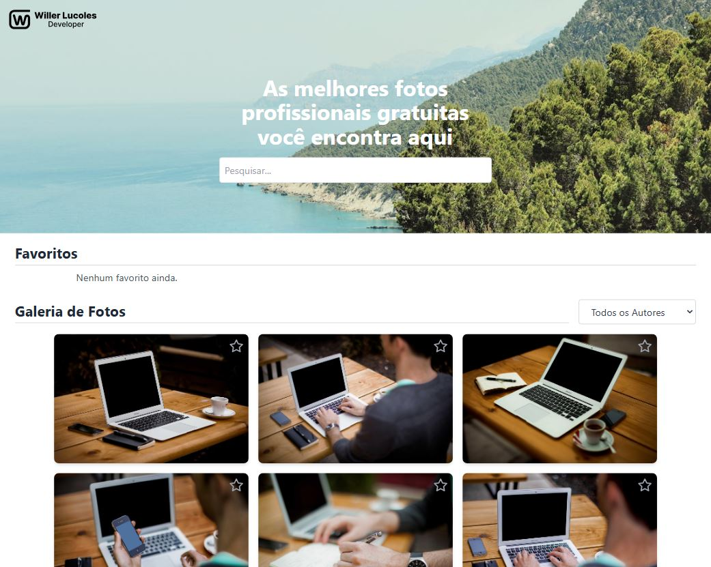

# Galeria de Imagens -  Frontend Fusion

Este é o desafio de criação de uma Galeria de Imagens, desenvolvido como parte do processo seletivo do projeto Frontend Fusion. O objetivo é consumir a API [Picsum Photos](https://picsum.photos/v2/list) e criar uma aplicação funcional com React.

## 🎯 Funcionalidades Implementadas

1. **Galeria de Imagens**:
   - Exibe imagens consumidas da API.
   - Organiza as imagens em um layout responsivo.

2. **Seção de Favoritos**:
   - Permite favoritar imagens e exibi-las em uma seção específica.
   - As imagens favoritadas mantêm todos os comandos da galeria (baixar, visualizar, desfavoritar).

3. **Pesquisa no Header**:
   - Campo de pesquisa em tempo real.
   - Filtro por:
     - Nome do autor.
     - Número de ID.
     - Dimensões (formato `largura x altura`).

4. **Filtro de Autores**:
   - Menu desdobrável que permite filtrar imagens por autor.
   - Funciona de forma independente da pesquisa no header.

5. **Baixar Imagens**:
   - Botão em cada card que abre a imagem em uma nova aba para visualização ou download.

6. **Efeitos Visuais e Responsividade**:
   - Hover para exibir detalhes como nome do autor e botão de download.
   - Design responsivo para desktops e dispositivos móveis.

## 🚀 Tecnologias Utilizadas

- **React**: Framework principal.
- **Tailwind CSS**: Estilização rápida e responsiva.
- **API Picsum Photos**: Fonte das imagens.
- **React Icons**: Ícones para botões e interatividade.

